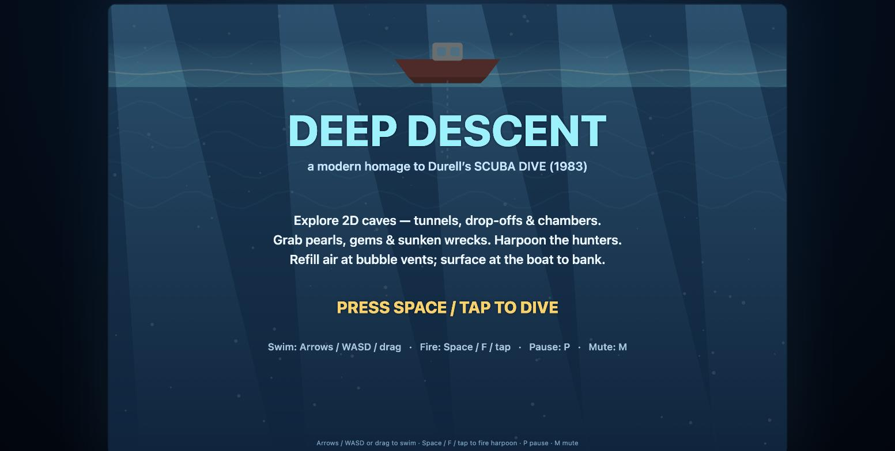
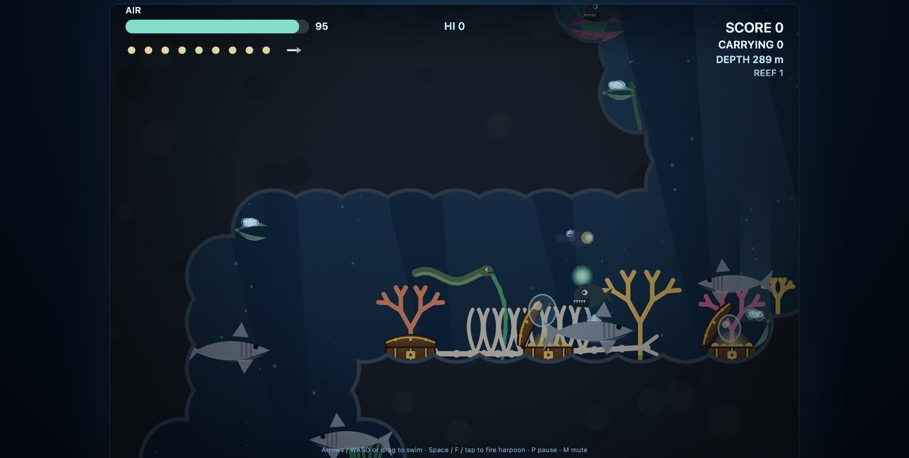
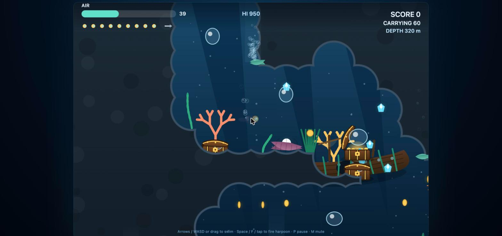
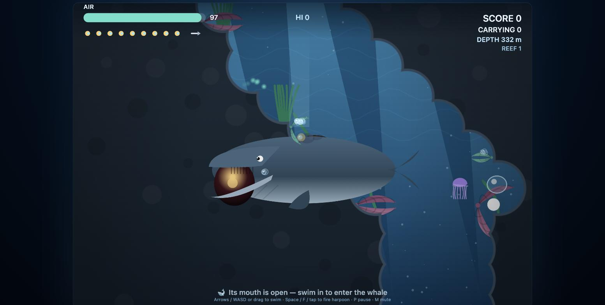
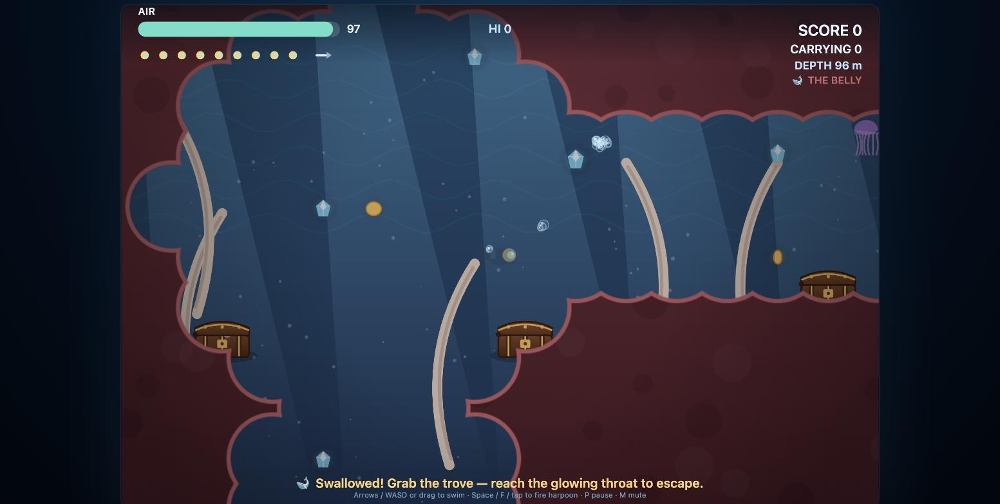
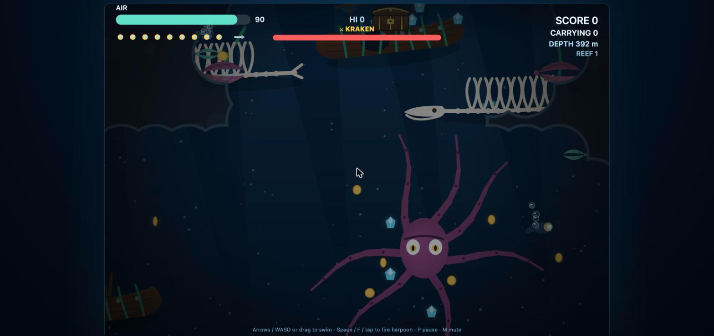
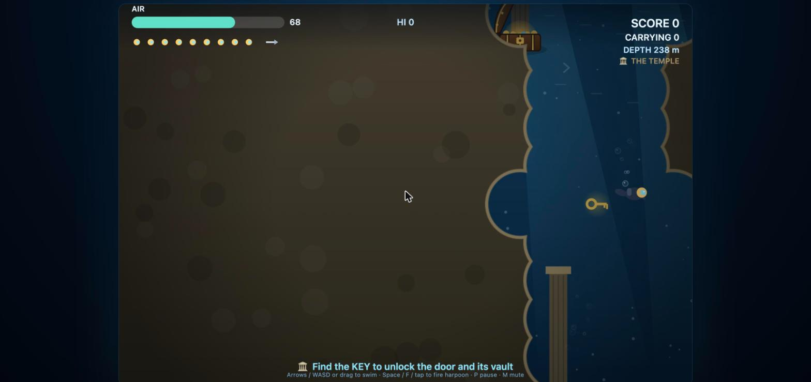

# 🤿 Deep Descent

**A modern, browser-based homage to Durell Software's *Scuba Dive* (1983).**

### ▶ <a href="https://evelo2.github.io/Deep-Descent/" target="_blank" rel="noopener noreferrer">Play it in your browser</a> — no install



Dive from your boat into a hand-carved network of underwater caves — thread the
tunnels and drop-offs, prise pearls from giant clams, crack open sunken treasure
chests, plunder shipwrecks for gold and gems, and harpoon the hunters of the
deep. All the while your air ticks down, so keep an eye out for bubble vents…
and know when to surface. Bank your haul, then sail on to a fresh reef.

Built with plain HTML5 Canvas and vanilla JavaScript — **no build step, no
dependencies, no install.** It runs in any modern browser and works with
keyboard or touch.

> This project was reconstructed from the original ZX Spectrum `.z80` memory
> snapshot of *Scuba Dive* (included in the repo as a historical artifact) and
> re-imagined with modern graphics, physics, audio, and game feel. **All code
> and artwork are new and original.**

---

## Table of contents

- [Screenshots](#screenshots)
- [About the original](#about-the-original)
- [Getting started](#getting-started)
- [How to play](#how-to-play)
- [Features](#features)
- [Roadmap](#roadmap)
- [Under the hood](#under-the-hood)
- [Project structure](#project-structure)
- [Credits & acknowledgements](#credits--acknowledgements)
- [License](#license)

---

## Screenshots

**The deep** — it darkens as you descend, and the creatures change: eels and a
glowing anglerfish prowl the dark, with whale skeletons on the floor.



**Shipwrecks & treasure** — chests hinge open on ledges and wreck decks, spill
gold, and puff out air bubbles… then snap shut.



**The whale** — catch its mouth open and swim in to be swallowed.



**The Belly** — inside the whale: a rib-lined, fleshy cavern packed with the
richest trove in the game. Grab it and find the glowing throat to escape.



**The kraken** — a boss guarding a gem hoard in the deep. Dodge its tentacles
and harpoon it down.



**The sunken temple** — find the key to open the door and plunder the vault.



---

## About the original

*Scuba Dive* was released in **1983 by Durell Software Ltd**, a British game
studio founded by **Robert White** and based in Taunton, Somerset. It became one
of the era's beloved underwater arcade games on the **ZX Spectrum** (and other
8-bit home computers): you played a diver descending through the ocean to collect
pearls and treasure while dodging octopuses, sharks, jellyfish and snapping
giant clams, managing a dwindling air supply the whole way down.

**Deep Descent** keeps that gameplay loop intact and dresses it in a modern
coat: smooth vector art, a scrolling 2D cave world, particle effects, procedural
audio, and depth-driven atmosphere — a love letter to a classic, not a copy of
its code. Enormous thanks to Durell Software and everyone who made the original;
this exists because that game left a mark.

---

## Getting started

Deep Descent is just static files and ES modules — but browsers won't load ES
modules over `file://`, so you need to serve the folder over HTTP. Any tiny web
server works.

### 1. Get the code

```bash
git clone https://github.com/evelo2/Deep-Descent.git
cd Deep-Descent
```

### 2. Serve it locally

Pick whichever you have:

```bash
# Python 3 (bundled on macOS / most Linux)
python3 -m http.server 8000

# …or Node
npx serve .

# …or PHP
php -S localhost:8000
```

### 3. Play

Open **<http://localhost:8000/>** in your browser and press **Space** (or tap) to
dive.

> **Tip:** if you open `index.html` directly (a `file://` URL) the screen stays
> blank — that's the ES-module rule above. Use a local server.

*(Want it playable from a public URL with zero setup? GitHub Pages will host it
as-is — see [Deploying](#deploying).)*

---

## How to play

**Goal:** collect pearls, gems and treasure, and bring them back to the surface
to **bank** them into your score — before your **air** runs out.

| Action | Keyboard | Touch | Gamepad |
| --- | --- | --- | --- |
| Swim | Arrow keys / **WASD** | Drag (virtual joystick) | Left stick / D-pad |
| Fire weapon | **Space** / **F** | Quick tap | **A / X / RB / RT** |
| Hold to auto-aim | Hold **Space** / **F** | Hold 🎯 button | Hold fire |
| Switch weapon | **Q** / **E** or **[** **]** | ⋯ SWAP button | **Y / LB** |
| Light a flare (dark caves) | **G** | 🔥 button | **LT** |
| Open shop (at a station) | **B** | ⚙ SHOP button | **B** |
| Start / confirm / buy | **Space** | Tap | **A / Start** |
| How to play (help) | **H** | ❔ button | — |
| Pause | **P** / **Esc** | ⏸ button (top) | **Start** |
| Mute | **M** | 🔊 button (top) | **Back / Select** |
| Sail to a new reef | Hold **↑** at the boat | ⛵ **Sail On** button | Hold **↑** at the boat |

**🎮 Controllers work out of the box** — Steam Deck, ROG Ally / Ally X, and any
pad the browser exposes via the Gamepad API. Open the game in the device's
browser and press a button.

**📱 Touch-friendly** — on phones and tablets, drag anywhere to swim and tap to
fire. On-screen **pause**, **mute** and **⛵ Sail On** buttons appear so a
touch-only player can pause, mute and progress between reefs; the canvas clears
notches and home indicators via safe-area insets.

### The loop

1. **Dive.** A shaft drops straight down from beneath the boat; the rest of the
   cave — tunnels, vertical drop-offs and open chambers — is yours to explore
   sideways and down.
2. **Loot.** Grab floating **coins** and **gems**, and time your approach to the
   **clams and chests**: they rattle, swing open, hold, then **snap shut**. Take
   the loot while they're open — get caught inside when they close and you lose a
   life.
3. **Breathe.** Air drains constantly (faster the deeper you go). Every time a
   shell opens it puffs out a **big air bubble** — swim through it to top up.
   **Bubble vents** on the cave walls stream air too. These are your lifeline for
   staying down.
4. **Hunt or flee.** **Harpoon** sharks, octopuses, eels and glowing anglerfish
   for points — or dodge them. Contact costs a life.
5. **Bank & sail on.** Return to the **boat** at the surface to refill air and
   **bank** everything you're carrying into your score. Then **hold ↑ into the
   boat** to set sail for a brand-new reef (a freshly generated cave; your score
   and lives carry over).
6. **🐋 Enter the whale (bonus).** A giant whale drifts through one chamber of
   each reef. Catch its **mouth open** and swim in — you're swallowed into *The
   Belly*, a rib-lined cavern holding the game's richest trove. There's no boat
   in there and your air keeps draining, so grab fast and swim to the **glowing
   throat** to escape back to the reef with your haul.

### Hazards & secrets

- **🌊 Currents.** Flowing water zones sweep you along — ride them through a
  tunnel, or fight across if you must. Watch the drifting chevrons for direction.
- **🦑 The kraken.** A boss lurks in the deepest chamber, guarding a gem hoard.
  Its tentacles reach for you (contact costs a life) — **harpoon it down** (watch
  the boss health bar) for a big bonus and a burst of treasure.
- **🏛 The sunken temple.** An ancient **stone gate** rests on a mid-deep ledge.
  Swim in to enter the temple, **find the key** to open the locked **door**, and
  plunder the **vault** behind it — then reach the exit gate to return.

> Each reef holds **at most one** special (whale, kraken *or* temple), and only
> sometimes — so every dive feels different.

- **⚡ Power-ups.** Grab floating pickups: **air tank** (permanent max-air boost),
  **multifire** (3-way harpoon spread), **shield** (temporary invulnerability),
  **speed fins** (faster swimming), **treasure magnet** (pulls nearby loot), and
  **1-UP** (an extra life). Active buffs show as timers in the HUD.
- **❤ Extra lives.** Every **5,000 points** banked earns you a life. Later reefs
  get gradually tougher, so the run stays tense as your lives grow.

### Tips

- The deeper you go, the **richer the loot** — and the **darker and more
  dangerous** the water. Sharks come in all sizes; the deep hides eels and
  anglerfish.
- Don't get greedy at a clam or chest — watch the rhythm and leave before the
  snap.
- Bank often. Treasure you're *carrying* is lost if you drown far from the boat.

---

## Features

- 🌊 **2D scrolling cave world** — procedurally carved tunnels, drop-offs and
  chambers, different every dive.
- 🐚 **Living shells** — clams, chests and air vents that rattle, open, hold and
  snap, each releasing a collectible air bubble.
- 🎯 **Harpoon gun** — spear the deep's hunters for points.
- 🚢 **Shipwrecks & 💎 treasure** — coins, gems, chests and sunken galleons.
- 🐟 **Depth-driven ecosystem** — jellyfish and pufferfish in the shallows,
  octopus and sharks in mid-water, eels and bioluminescent anglerfish in the
  dark — with **whale skeletons** on the deepest floors.
- 🫧 **Air management** — vents and bubbles let you push deeper without surfacing.
- ⛵ **Endless reefs** — sail the boat to a new cave whenever you like.
- 🐋 **Enter the whale** — a secret bonus zone inside a living whale, packed with
  the richest trove in the game.
- 🌊 **Currents** that sweep you through tunnels.
- 🦑 **Kraken boss** guarding a hoard in the deep — harpoon it down.
- 🏛 **Sunken temple** with a key-and-door puzzle and a treasure vault.
- 🔫 **Five weapons** — the **harpoon** (a scarce, limited-ammo kill-shot), the
  **net gun** (unlimited; snares creatures so you can slip past), the **speargun**
  (rapid burst), the **depth charge** (a hand-thrown mine — click to throw, click
  to detonate; the blast hurts you too), and the **shock rod** (battery-powered
  chain lightning). Switch on the fly.
- 🎯 **Hold-to-aim** — hold fire to root in place and auto-lock the nearest threat,
  then fire when lined up. Upgrade the **Targeting System** for faster aim & fire.
- 🕯️ **Dark caves & flares** — pitch-black chambers hide rich loot; light a
  **flare** (G) to see. Buy flares at the shop or find them in the world.
- 🔔 **Dive bells** — deep checkpoints that bank loot and refill air without surfacing.
- 💰 **Gold economy & shop** — banked loot pays out **points + gold**; spend gold
  at the boat or a bell to unlock/upgrade weapons, buy ammo, flares, air tanks
  and capacity (reef-gated; **upgrade prices double each level**). **Supply
  crates** and floor pickups drop free gear.
- ⚡ **Power-ups** — air tank, multifire, shield, speed fins, treasure magnet, 1-UP.
- ❤ **Extra life every 5,000 points**; each new reef is tougher (denser, bigger
  creatures and ~10% less air per reef).
- ⚓ **Per-reef relic objective** — find & bank the relic (or grind the points goal) to sail on.
- 🗺 **Fog-of-war minimap** that reveals the caves as you explore (and fades when you swim behind it).
- ❔ **In-game help** — a paged HOW TO PLAY screen (press **H**).
- 🎮 **Full controller support** (Steam Deck, ROG Ally, and more) alongside keyboard + touch.
- 🌿 **Atmosphere** — swaying kelp, coral and anemones, god-rays, caustics,
  parallax particulate, screen shake and a darkening, vignetting deep.
- 🔊 **Procedural Web Audio** — ambient bed and SFX, no audio files, mute toggle.
- 📱 **Responsive & cross-platform** — one codebase for desktop and touch, crisp
  on any DPI, high-score saved locally.

---

## Roadmap

Planned next: **one-shot special zones** (entrances vanish once used),
**cave-entrance minigames** (first up, a classic 1980s platformer stage), and a
**secure online scoring service**. These plus a longer backlog of ideas live in
**[docs/ROADMAP.md](docs/ROADMAP.md)** — suggestions welcome.

## Under the hood

- **Vanilla ES modules + HTML5 Canvas.** No framework, no bundler, no
  `node_modules`. Open the source and read it top to bottom.
- **Procedural everything.** Graphics are drawn as vector shapes (sharp at any
  resolution), audio is synthesized with the Web Audio API, and caves are
  generated by "miner" agents then rendered from a smooth distance field.
- **Fixed logical playfield** (900×600) scaled to fit any viewport, with a 2D
  camera that follows the diver through a much larger world.

No dependencies means it will still run in ten years. It's also a compact,
readable example of a complete little game if you're learning Canvas.

---

## Project structure

```
index.html                     entry page (canvas + module bootstrap)
src/
  main.js                      canvas/DPI setup + requestAnimationFrame loop
  config.js                    tuning constants, palette, shared curves
  input.js                     keyboard + touch + gamepad → intent vector
  audio.js                     procedural Web Audio ambient + SFX
  game.js                      state machine, world/zone gen, collisions, HUD,
                               camera, objectives, weapons/ammo, shop, help,
                               dark caves, minimap
  entities/                    diver, boat, shell (clam/chest), bigbubble,
                               treasure, creatures, harpoon, airvent, wreck,
                               whale, kraken, current, powerup, relic,
                               divebell, weapons (net/depth-charge/supply-crate)
  systems/
    cave.js                    2D cave gen + distance-field collision/render +
                               fog-of-war minimap buffer
    particles.js               bubbles + sparkles
  render/
    background.js              ocean, god-rays, caustics, parallax
    sprites.js                 diver, clam & creature vector art
    props.js                   wreck, chest, gem, whale skeleton, ribs, throat,
                               temple gate/door/key/column, relic icons
    flora.js                   kelp, coral, anemones, polyps
docs/
  DESIGN.md                    design notes, platform decision, version log
  ROADMAP.md                   future feature ideas
  screenshots/                 README images
Scuba_Dive_1983_Durell_Software.z80   the original snapshot (historical source)
```

## Deploying

Because it's fully static, **GitHub Pages** hosts it with no build:

1. Push to GitHub (already done if you're reading this there).
2. Repo **Settings → Pages → Build and deployment → Source: Deploy from a
   branch**, pick `main` and `/ (root)`, save.
3. Your game goes live at `https://evelo2.github.io/Deep-Descent/` in a minute
   or two.

Any static host (Netlify, Vercel, Cloudflare Pages, itch.io) works the same way —
just point it at the repo root.

---

## Credits & acknowledgements

- **Original game:** *Scuba Dive* © 1983 **Durell Software Ltd** — the
  inspiration for everything here. Deep gratitude to Durell and its team for a
  classic that's still fun to think about four decades on.
- **This homage:** all new code and artwork, built as a personal, non-commercial
  tribute.

*If you worked on the original Scuba Dive and would like a correction or fuller
credit here, please open an issue — I'd be glad to get it right.*

---

## License

The original code and artwork in this repository are released under the
**[MIT License](LICENSE)** — free to use, modify and share.

This is a fan-made, **non-commercial tribute**, not affiliated with or endorsed
by Durell Software. *Scuba Dive* and any related marks belong to their
respective owners, and the included `Scuba_Dive_1983_Durell_Software.z80`
snapshot is provided as a historical reference only — it is **not** covered by
the MIT license above.
